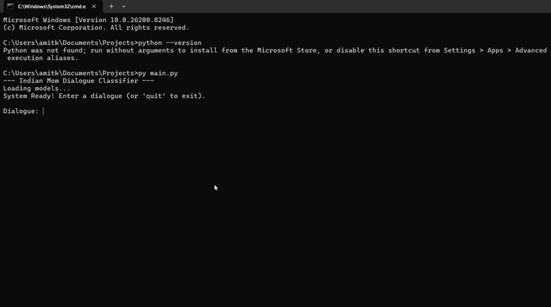

# Indian Mom Dialogue Classifier

## Project Description
This project is a Natural Language Processing (NLP) application designed to classify and interpret dialogues commonly used by Indian parents. It focuses on the linguistic nuances of Hinglish to identify the underlying emotion, the real meaning behind the words, and the associated threat level.

## Tech Stack & Rationale

### 1. Python
The core programming language chosen for its extensive library ecosystem for data science and machine learning.

### 2. Scikit-learn
Used for implementing the Machine Learning pipeline.
- **TF-IDF Vectorization:** We used `TfidfVectorizer` with `ngram_range=(1, 2)`. This is crucial for Hinglish because it captures both single words and two-word phrases (e.g., "phone" and "phone chalao"), which are often more meaningful in this context than individual words alone.
- **Logistic Regression:** Chosen as the primary classifier. For a dataset of ~600 samples, complex deep learning models (like BERT) often overfit. Logistic Regression is highly efficient, provides clear probability outputs, and works exceptionally well for text classification with smaller datasets.

### 3. Pandas & NumPy
Used for data manipulation and structured storage of the master dataset.

### 4. Joblib
Used for model serialization, allowing the pre-trained models to be loaded instantly in the terminal interface without needing to re-train.

## How the Model Works

### Layer 1: Emotion Classification
A multi-class Logistic Regression model predicts the tone of the dialogue (e.g., Sarcasm, Anger, Love). It analyzes the frequency and importance of words within the input to determine the most likely emotional state.

### Layer 2: Threat Level Prediction
A separate classifier predicts the severity of the situation (Low, Medium, High, RIP). This helps in calculating the "Danger Meter" for the user.

### Layer 3: Semantic Retrieval for Hidden Meaning
Instead of a simple lookup, we use **Cosine Similarity**.
- The system converts the user's input into a vector and compares it against all 600+ dialogues in our dataset.
- It finds the closest match based on the mathematical "distance" between the sentences.
- This allows the system to provide the "Hidden Meaning" even if the user's input doesn't exactly match the dataset (e.g., if the user types "phone mat dekho" instead of "phone mat chalao").

## Interface
- Terminal-based Command Line Interface (CLI) for real-time dialogue analysis.

## Sample Dialogues
Here are some examples of what the classifier decodes:

| Dialogue | Predicted Emotion | Hidden Meaning | Threat Level |
| :--- | :--- | :--- | :--- |
| "Phone hi chala lo pura din" | Sarcasm | You are a phone addict | LOW |
| "Ghar aa tu, phir batati hu" | Anger | You are in big trouble once you get home | HIGH ⚠️ |
| "Beta, khana kha liya?" | Care | Checking if you're hungry | LOW |
| "Sharma ji ka beta dekho" | Disappointment | Compare yourself to others | MEDIUM |
| "Zinda gaad dungi" | Anger | I'm beyond furious | RIP ⚠️⚠️⚠️ |
| "Theek hai, meri mat suno" | Emotional Blackmail | Ignore me, you'll regret it | MEDIUM |
